# 🤖 Marketing Knowledge Assistant

> A sophisticated AI-powered marketing assistant that combines RAG (Retrieval-Augmented Generation) with long-term memory to provide personalized marketing insights, content generation, and strategic advice for businesses.

[](https://www.python.org/downloads/)
[](LICENSE)
[](https://langchain.com/)
[](https://qdrant.tech/)

---

## ✨ Features

| Feature | Description |
|---------|-------------|
| 🧠 **Intelligent Document Processing** | Semantic chunking of PDFs and JSON files with OCR support |
| 🗄️ **Dual-Database Architecture** | Separate collections for general marketing knowledge and business-specific data |
| 🔀 **Smart Query Decomposition** | Automatically splits complex queries into targeted searches |
| 💾 **Long-Term Memory** | Remembers user preferences, business details, and conversation history |
| 🎯 **Personalized Responses** | Adapts communication style and recommendations based on user context |
| ✍️ **Multi-Modal Content Generation** | Creates social media posts, ads, emails, and marketing strategies |
| 🔄 **Automatic Scraping Tools** | Keeps knowledge base continuously updated with latest marketing trends |

---

## 🏗️ System Architecture

```
┌─────────────────────┐
│    📝 User Query    │
└──────────┬──────────┘
           │
           ▼
┌─────────────────────┐
│  🧠 LLM Decomposer  │ ──► Splits into business_query + general_query
└──────────┬──────────┘
           │
      ┌────┴────┐
      ▼         ▼
┌───────────┐ ┌───────────┐
│💼Business│ │📚 General │
│   Docs   │ │   Docs    │ ──► 🔍 Qdrant Vector Search
└─────┬─────┘ └─────┬─────┘
      │             │
      └──────┬──────┘
             ▼
      ┌─────────────┐
      │📦 Context   │
      │   Builder   │
      └──────┬──────┘
             │
             ▼
      ┌─────────────┐
      │🤖 LLM       │ ──► ✅ Personalized Answer
      │  Response   │
      └──────┬──────┘
             ▲
             │
      ┌──────┴──────┐
      │🌐 Auto      │ ──► 🔄 Continuous Updates
      │  Scraping   │
      └─────────────┘
```

---

## 🛠️ Technologies Used

### 🤖 AI & Machine Learning
- **LangChain** - Agent orchestration and workflow management
- **LangGraph** - Stateful agents with checkpointing
- **LangMem** - Long-term memory and user context persistence
- **🤗 Transformers** - Local LLM inference (Qwen2.5-1.5B-Instruct)
- **Sentence Transformers** - Semantic embeddings (all-MiniLM-L6-v2)

### 🗄️ Vector Database
- **Qdrant Cloud** - High-performance semantic search and storage

### 🧠 LLM Providers
- **⚡ Groq API** - Ultra-fast inference (Llama-3.1-8b-instant)
- **Anthropic Claude** - Advanced query understanding
- **OpenAI** - Alternative backend support

### 📄 Document Processing
- **PyMuPDF** - PDF text extraction and manipulation
- **pdf2image + Pytesseract** - OCR for scanned documents
- **Python Magic** - Automatic file type detection

### 🌐 Web Scraping & Updates
- **Automated scraping pipeline** - Continuously updates marketing knowledge
- **Real-time data ingestion** - Keeps strategies and trends current

### 💻 Interface
- **Gradio** - Interactive web-based chatbot UI

---

## 📊 How It Works

### 1️⃣ Dual Knowledge Base

#### 📚 General Marketing Knowledge
- 📱 Social media strategies (TikTok, Instagram, YouTube)
- 📝 Marketing templates and frameworks
- 🔍 SEO and content marketing guides
- 💡 Industry best practices
- 🔄 *Automatically updated via web scraping*

#### 💼 Business-Specific Data
- 🛍️ Product catalog and descriptions
- ⭐ Customer reviews and feedback
- 🎨 Brand guidelines and KPIs
- 👥 Customer profiles and personas

---

### 2️⃣ Smart Query Processing

When you ask a question:

```
1. 🧠 LLM analyzes your intent
   ↓
2. 🔀 Decomposes into targeted sub-queries
   ↓
3. 🔍 Searches both databases simultaneously
   ↓
4. 📊 Ranks results by semantic relevance
   ↓
5. 📦 Builds context from top matches
   ↓
6. ✨ Generates personalized response using your profile
```

---

### 3️⃣ Continuous Learning

| Component | Description |
|-----------|-------------|
| 🧠 **Short-term memory** | Maintains conversation context within sessions |
| 💾 **Long-term memory** | Stores user preferences and business details across sessions |
| 🔄 **Auto-updates** | Scraping tools refresh marketing knowledge regularly |
| 📈 **Profile building** | Learns more about your business with each interaction |

---

## 🎯 Use Cases

### ✍️ Content Creation
> Generate platform-specific content: social posts, blogs, emails, ads, product descriptions

### 📋 Strategic Planning
> Campaign ideation, channel strategy, content calendars, audience targeting

### 🎨 Brand Development
>  storytelling, positioning

### 🚀 Product Marketing
> Launch strategies, feature messaging, competitive differentiation

---


## 📈 Workflow Example

```mermaid
graph TD
    A[👤 User asks: Write a TikTok ad for Luna Denim Jacket] --> B[🧠 LLM Decomposer]
    B --> C[💼 Search Business Docs: Luna Denim Jacket details]
    B --> D[📚 Search General Docs: TikTok ad best practices]
    C --> E[📦 Context Builder]
    D --> E
    E --> F[💾 Add User Memory & Preferences]
    F --> G[🤖 Generate Personalized Ad]
    G --> H[✅ Deliver TikTok Ad Copy]
    H --> I[💾 Update Long-term Memory]
```


</div>
